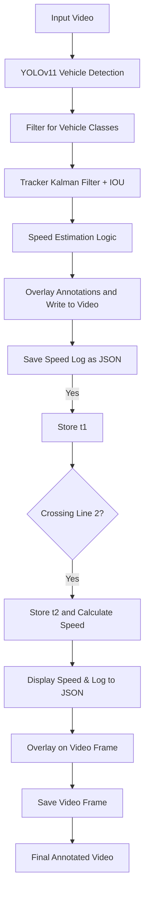

# 🚗 Vehicle Speed Detection System using YOLOv11

This project detects moving vehicles in a video, tracks them, and calculates their speed based on how long they take to cross a known real-world distance between two virtual lines. The system uses the **YOLOv11 object detection model**, **Kalman filter tracking**, and a custom **speed estimation module**.

---

## 📌 Problem Statement

Given a road surveillance video:
- Detect vehicles.
- Track them as they move.
- Estimate and log their speed when they cross two predefined horizontal lines that are a known real-world distance apart.
- Display the tracked vehicles with ID and speed on the video.

---

## ✅ Key Features

- ⚡ Real-time vehicle detection using **YOLOv11**.
- 🧠 Tracking using **Kalman Filter** + simple IOU-based matching.
- 📏 Speed estimation using timestamped line crossing.
- 🧾 Logs speed events and tracks to `speed_log.json`.
- 📹 Annotated output saved as `result.mp4`.
- 🛠️ Logging system integrated for each key operation.
- ❌ Ignores **parked motorbikes** and **persons** for speed estimation.

---

## 📊 System Workflow



---

## 🧠 Solution Strategy

### 1. **Detection using YOLOv11**
- A lightweight YOLOv11 model is used for real-time detection.
- Objects filtered for: `"car", "bus", "truck", "motorbike", "bicycle"`
- Persons are **detected but ignored** for speed calculation.

### 2. **Tracking using Kalman Filter**
- Each detection is assigned a `Track` with a unique `track_id`.
- Kalman filter predicts object location in the next frame.
- IOU matching updates the track with new detection if IOU > 0.3.

### 3. **Speed Estimation**
- Two horizontal lines (`LINE1_Y`, `LINE2_Y`) are drawn across the video.
- The center of each tracked box is checked:
  - When it crosses line 1: store time `t1`
  - When it crosses line 2: store time `t2`
  - Speed = `distance / (t2 - t1)` → converted to km/h

### 4. **Persistent Speed Display**
- Once calculated, the speed is shown **until the vehicle disappears** from view (not just 1 second).

### 5. **Logging System**
- Logs are written to `speed_analyzer.log` using Python’s `logging` module.
- Actions such as frame read, detection, tracking, speed estimation, and errors are recorded.

---

## 🗂️ Project Structure

```
vehicle-speed-detector/
│
├── detector.py           # YOLOv11 detection logic
├── tracker.py            # Kalman filter + IOU tracking
├── speed_estimator.py    # Speed calculation logic
├── track_video.py        # Main video processing and orchestration
├── speed_log.json        # Output speeds and timestamps
├── result.mp4            # Annotated output video
├── speed_analyzer.log    # Log file for debugging and status
├── README.md             # Project documentation
└── requirements.txt      # Python dependencies
```

---

## 📽️ Sample Output

**Speed is displayed with tracking ID until the vehicle exits frame.**
Two virtual lines are drawn:
- 🔵 Blue Line: Entry (Line 1)
- 🔴 Red Line: Exit (Line 2)

Each vehicle is shown with:
```
ID 17 | 39.3 km/h
```

---

## 🧪 How to Run the Project

1. **Install Dependencies**
   ```bash
   pip install -r requirements.txt
   ```

2. **Place your input video**
   - Add the video to the root as `sample.mp4`.

3. **Run the main script**
   ```bash
   python track_video.py
   ```

4. **Output**
   - `result.mp4`: Annotated video
   - `speed_log.json`: JSON speed log
   - `speed_analyzer.log`: Logs for each step

---

## 🛠️ Enhancements Done

| Feature                          | Status     | Notes                                                  |
|----------------------------------|------------|---------------------------------------------------------|
| YOLOv11 integration              | ✅         | Lightweight detection using `ultralytics`               |
| Kalman Tracking                  | ✅         | Smooth tracking with ID persistence                    |
| IOU Matching                     | ✅         | Ensures correct object association across frames        |
| Speed Estimation (accurate)      | ✅         | Calculated in km/h using real-world distance            |
| Persistent speed overlay         | ✅         | Speed shown until object disappears                    |
| Log system                       | ✅         | Logs for detection, tracking, speed, errors            |
| Ignore persons                   | ✅         | Avoids false speed on humans                           |
| Detect motorbikes with rider     | ✅         | Adjusted to detect rider+vehicle as a unit             |

---

## 📦 Sample `speed_log.json`

```json
[
  {
    "track_id": 17,
    "speed_kmph": 39.3,
    "timestamp": 53.17
  },
  {
    "track_id": 43,
    "speed_kmph": 54.0,
    "timestamp": 127.17
  }
]
```

---

## 📸 Diagram - Video Frame Example

```
+-----------------------------------------------------+
| ID 17 | 39.3 km/h                                   |
|  ________                                            |
| |        |                                          |
| |  CAR   |      <-- ID & Speed persist              |
| |________|                                          |
|                                                     |
|  -----------------  ← LINE 1 (Blue)                 |
|                                                     |
|  -----------------  ← LINE 2 (Red)                  |
+-----------------------------------------------------+
```

---

## 🧾 Logging Example (`speed_analyzer.log`)

```
[INFO] Frame 47 read successfully.
[INFO] Detected 3 objects.
[INFO] Tracked ID 17 at bbox [405, 320, 500, 420]
[INFO] Track ID 17 crossed line 1 at 52.8s
[INFO] Track ID 17 crossed line 2 at 53.17s
[INFO] Track ID 17 speed estimated: 39.3 km/h
```

---

## 📧 Contact

Maintained by Mondi Venkata Kartikeya – SWE Intern @ Precistat IT Solutions  
Feel free to contribute or raise issues for improvements.
