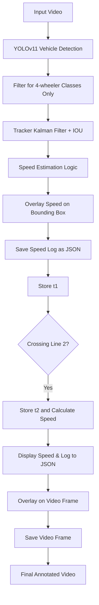

# 🚗 Vehicle Speed Detection System using YOLOv11

This project detects moving vehicles in a video, tracks them, and calculates their speed based on how long they take to cross a known real-world distance between two virtual lines. The system uses the **YOLOv11 object detection model**, **Kalman filter tracking**, and a custom **speed estimation module**.

---

## 📌 Problem Statement

Given a road surveillance video:

* Detect vehicles.
* Track them as they move.
* Estimate and log their speed when they cross two predefined horizontal lines that are a known real-world distance apart.
* Display the tracked vehicles with their speed on the video.

---

## ✅ Key Features

* ⚡ Real-time vehicle detection using **YOLOv11**.
* 🧠 Tracking using **Kalman Filter** + simple IOU-based matching.
* 📏 Speed estimation using timestamped line crossing.
* 🧾 Logs speed events and tracks to `speed_log.json`.
* 📹 Annotated output saved as `result.mp4`.
* 🛠️ Logging system integrated for each key operation.
* ❌ Ignores **2-wheelers** and **persons** for speed estimation.
* ❌ Filters out slow vehicles moving below 5 km/h.

---

## 📊 System Workflow



---

## 🧠 Solution Strategy

### 1. **Detection using YOLOv11**

* Uses a lightweight YOLOv11 model from `ultralytics` for fast detection.
* Only detects 4-wheelers: `"car", "bus", "truck"`.
* Persons and 2-wheelers (`"motorbike", "bicycle"`) are ignored for speed detection.

### 2. **Tracking using Kalman Filter**

* Each detection is assigned a `Track` with a unique `track_id`.
* Kalman filter predicts object location in the next frame.
* IOU matching updates the track with new detection if IOU > 0.3.

### 3. **Speed Estimation**

* Two horizontal lines (`LINE1_Y`, `LINE2_Y`) are drawn across the video.
* The center of each tracked box is checked:

  * When it crosses line 1: store time `t1`
  * When it crosses line 2: store time `t2`
  * Speed = `distance / (t2 - t1)` → converted to km/h

### 4. **Speed Display Only**

* Speed is shown **without any vehicle ID**.
* Display persists until vehicle leaves the frame.

### 5. **Minimum Speed Threshold**

* Vehicles with speed < 5 km/h are ignored to avoid false detections from static/slow movement.

### 6. **Logging System**

* Logs are written to `speed_analyzer.log` using Python’s `logging` module.
* Each major event (frame read, detection, tracking, speed estimation) is logged.

---

## 🗂️ Project Structure

```
vehicle-speed-detector/
│
├── detector.py           # YOLOv11 detection logic
├── tracker.py            # Kalman filter + IOU tracking
├── speed_estimator.py    # Speed calculation logic
├── track_video.py        # Main video processing and orchestration
├── speed_log.json        # Output speeds and timestamps
├── result.mp4            # Annotated output video
├── speed_analyzer.log    # Log file for debugging and status
├── README.md             # Project documentation
└── requirements.txt      # Python dependencies
```

---

## 📽️ Sample Output

**Speed is displayed above the bounding box.**
Two virtual lines are drawn:

* 🔵 Blue Line: Entry (Line 1)
* 🔴 Red Line: Exit (Line 2)

Each vehicle is shown with:

```
39.3 km/h
```

---

## 🧪 How to Run the Project

1. **Install Dependencies**

   ```bash
   pip install -r requirements.txt
   ```

2. **Place your input video**

   * Add the video to the root as `sample.mp4`.

3. **Run the main script**

   ```bash
   python track_video.py
   ```

4. **Output**

   * `result.mp4`: Annotated video
   * `speed_log.json`: JSON speed log
   * `speed_analyzer.log`: Logs for each step

---

## 🛠️ Enhancements Done

| Feature                        | Status | Notes                                            |
| ------------------------------ | ------ | ------------------------------------------------ |
| YOLOv11 integration            | ✅      | Lightweight detection using `ultralytics`        |
| Kalman Tracking                | ✅      | Smooth tracking with ID persistence              |
| IOU Matching                   | ✅      | Ensures correct object association across frames |
| Speed Estimation (accurate)    | ✅      | Calculated in km/h using real-world distance     |
| Persistent speed overlay       | ✅      | Speed shown until object disappears              |
| Log system                     | ✅      | Logs for detection, tracking, speed, errors      |
| Ignore persons                 | ✅      | Avoids false speed on humans                     |
| Ignore 2-wheelers              | ✅      | Detects only 4-wheelers (car, bus, truck)        |
| Filter slow vehicles (<5 km/h) | ✅      | Removes static or nearly stopped vehicles        |

---

## 📦 Sample `speed_log.json`

```json
[
  {
    "track_id": 17,
    "speed_kmph": 39.3,
    "timestamp": 53.17
  },
  {
    "track_id": 43,
    "speed_kmph": 54.0,
    "timestamp": 127.17
  }
]
```

---

## 📸 Diagram - Video Frame Example

```
+-----------------------------------------------------+
| 39.3 km/h                                          |
|  ________                                           |
| |        |                                         |
| |  CAR   |      <-- Speed only, no ID              |
| |________|                                         |
|                                                    |
|  -----------------  ← LINE 1 (Blue)                 |
|                                                    |
|  -----------------  ← LINE 2 (Red)                  |
+-----------------------------------------------------+
```

---

## 🧾 Logging Example (`speed_analyzer.log`)

```
[INFO] Frame 47 read successfully.
[INFO] Detected 3 objects.
[INFO] Tracked ID 17 at bbox [405, 320, 500, 420]
[INFO] Track ID 17 crossed line 1 at 52.8s
[INFO] Track ID 17 crossed line 2 at 53.17s
[INFO] Track ID 17 speed estimated: 39.3 km/h
```

---

## 📧 Contact

Maintained by Mondi Venkata Kartikeya – SWE Intern @ Precistat IT Solutions
Feel free to contribute or raise issues for improvements.
